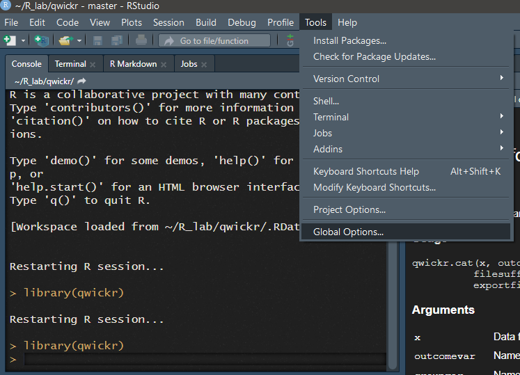
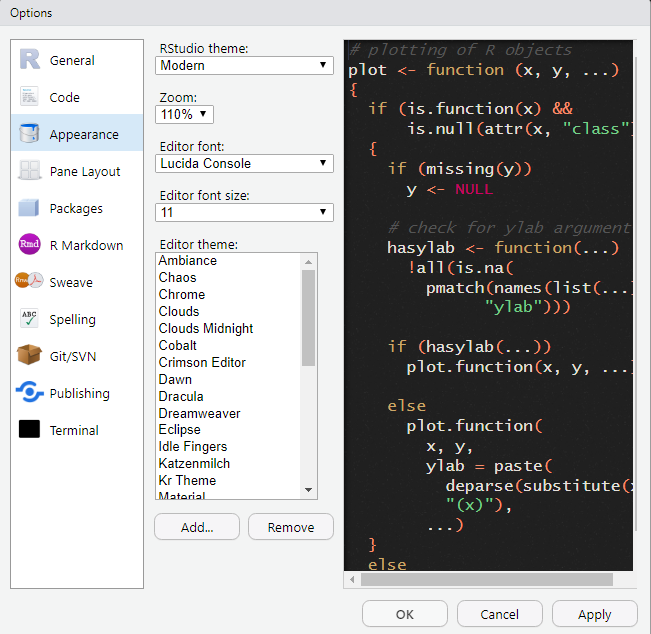

# qwick_ambiance
Remix of the Ambiance theme for RStudio

## Installation
1. Go to the **Tools** menu and select **Global Options**.
2. On the Global Options dialogue box, select **Appearance** on the left pane.
3. Click **Add** on the right pane, select the theme file `qwick_ambiance.rstheme` and click **Open** to upload the theme file.
4. Select the new theme *Qwick_Ambiance* from the list of themes and click **Apply**
5. Click **OK** to complete the process and close the dialogue box

